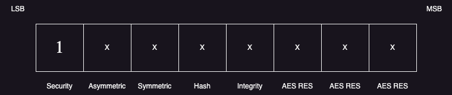

# Mask

The Mask is the first byte in any **Blackwing** message. This byte tells the server what to expect. 
The LSB indicates whether the server should expect a traditional **Blackwing** message, containing a stamp and a letter, or another
type of message, for example, one starting with a session.

## Secure Mask

### Asymetric algorithm choosing

The second bit indicates the Asymetric algorithm used to encrypt the Stamp. 
There are currently only two algorithms supported by the protocol, the `RSAES-OAEP`, where it uses the OAEP padding scheme. This method is the safest and should be prefered. 
however, because some libraries still provide `RSAES-PKCS1-v1_5` only, one as chosen to provide it as well. Neverthless, if possible do not use it.

For the `RSAES-OAEP` the *mask generation function* should be `MGF1`, consistent with either the SHA1 or SHA256 algorithm, chosen by the fourth mask bit. 

If you intend to use the `RSAES-OAEP` algorithm please ensure the second bit is set to **0**, `(mask &= (253))`. If you want to use the `RSAES-PKCS1-v1_5` algorithm please ensure the second bit is set to **1**, `(mask |= (2))`.

### Symetric algorithm choosing

The third bit indicates the AES algorithm chosen. Currently there are two modes available, the `CFB` and the `CBC`.  

### SHA algorithm choosing

## Unsecure Mask

Besides the name, the unsecure mask is not unsecure, it simply serves other purposes, namely when the user wants to use sessions to reduce the protocols overhead. The LSB should be `0` to signal the use of a non-traditional mask+stamp+letter message. 

The second bit signals the use of sessions. If the second bit is set to `1`, the server knows that the user intends to use a previous stored session, and the 8 bytes that follow the mask will be the `Session ID`. In this case, the server will use the stored AES Key, AES IV, and AES mode used in the connection that set the session. Note that, in this case, the AES context is always reset. 

The third bit is used to request for the public key. In this case, the server should implement a method to provide the user with the public key. We let the developers to choose the method they want to do such thing. Note that the server must accept that the user sends a session, to ensure that one can encrypt the upcomming data with it. This way, a more secure way to transmit data can exist. 

