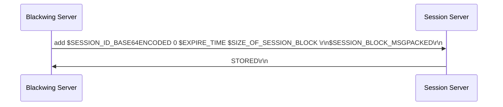
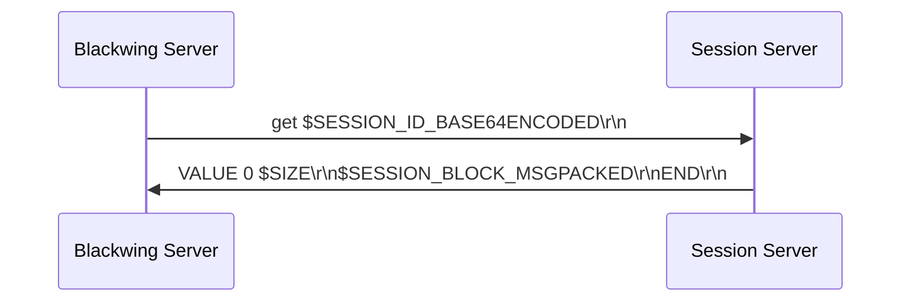

# Server

The following section describe how to install and use the Blackwing server provided by the author. I encourage anyone that wants to make their own implementation, and to share with the community. 

## Server Configuration File

To server's configuration is set through an `.yaml` file, that must be passed through the `configuration_file` parameter for the class constructor. The file can have the following keywords.

| Keyword | Description |
|:-------:|-------------|
| rsa_private_key | The RSA private key to use. Should be in PEM format. |
| max_packet_size | The maximum bytes to read for each package. |
| max_message_size | The maximum bytes accepted to be received in a communication |
| timeout | The maximum time to wait until devide that the connection is no longer available |
| stealth_mode | |
| expiration_mode | If the stamp must always have a timestamp. |
| expiration_time | The amount of seconds each stamp is alive. |
| microservices_folder | The folder where the `.yaml` files of each microservice can be found. | 
| server_type | Wheter to create an UDP or TCP server.
| hostname | The hostname to listen to. |
| port | The port to listen to. |
| max_num_connections | The maximum amount of connections to accept, and handle at the same time. |
| session_manager_ip | The IP address for the session manager. |
| session_manager_port | The port for the session manager. |
| session_expire | The session's time to live in seconds. |

## Generating RSA Keys

### Using Python

```python
from Crypto.PublicKey import RSA
import yaml 

key = RSA.generate_key(1024)

yaml.safe_dump(key.export_key())

```


## Python Module

The python module provide a more 

## Docker 

Please check the following link [https://blackwing.readthedocs.io/en/latest/docker/#blackwing_server](https://blackwing.readthedocs.io/en/latest/docker/#blackwing_server)

## Session Manager

The server will connect to the server manager using the IP Address and Port given in the server configuration file by the keywords: `session_manager_ip` and `session_manager_port`. By default it will try to connect to a memcached server running in the localhost and the standard port `11211`. However, one can use another type of database or caching system. Basically, the server makes a standard TCP connection and sends the following message:

### Add a new sessionn



```
# Message send to add a new session
add $SESSION_ID_BASE64ENCODED 0 $EXPIRE_TIME $SIZE_OF_SESSION_BLOCK \r\n
$SESSION_BLOCK_MSGPACKED\r\n
```

It expects to receive a 


```
```

### Fetch a session

