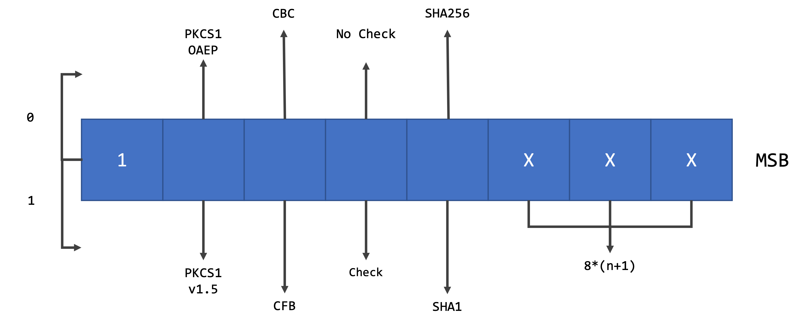

Protocol
=====

.. _Mask:

Mask
------------

The first byte of a Blackwing message is the setup for everything that comes next. This byte is called the mask and provides the server with information regarding what to expect and how to behave. 

The first bit (LSB) in the mask defines if the message is sent in ``secure (if 1)`` or ``not secure (if 0)`` mode.
   

   
.. note::
  
   The mask is what defines the server's behaviour. Therefore, pay attention to what you are setting. Most errors occur due to a bit mistake. 

.. _SecureMode:

Secure Mode
~~~~~~~~

The secure mode tells the server that the Stamp is encrypted with the RSA public key. This mode 

.. _NotSecureMode:

Not Secure Mode
~~~~~~~~

The not secure mode does not means that the message sent is not encrypted or that it does not go through an encrypted channel. It is just a way for the server to know that the Stamp is not encrypted through RSA. This mode should be used for:

* Request Public Key.
* Use previous stored session.
* To simply send a message to the microservice without any encryption (optional).

  
.. _Stamp:

Stamp
------------

The Stamp provides the server with information regarding the microservice to foward the message, and the AES keys to use. The Stamp is composed of 5 fields, one of them being optional, but should be considered to **avoid stamp reutilization**, which can be one method of attack. The stamp must be encrypted with the RSA public key. 

The fields in secure mode are:

#. Microservice ID (64 bits)
#. AES Key (16 bytes)
#. AES IV (16 bytes)
#. Stamp Request (1 Byte)
#. Timestamp (optional)

It exists a special Stamp for mask's ``not secure`` mode. This is when the client tells the server that there it is using a previous stored session. In this case, the Stamp is 8 bytes which represent the Session ID. For this case scenario, the AES Keys and IV to use are the previous ones. The server will send the message to the Microservice to whom the client connected before. 

.. note::

  The Stamp's size depends on the RSA key size chosen. For a 1024-bit, the minimum acceptable, the Stamp's size is 128 bytes. The size doubles as the key doubles in size.

.. note::

  The stamp must be msgpack serialized.
  
.. _Letter:

Letter
------------
