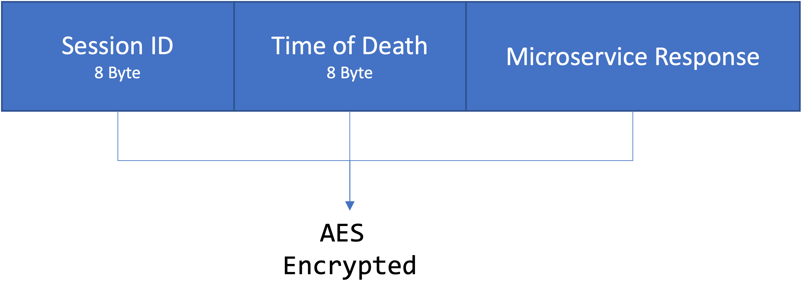

Session
=========

If the server can store sessions, it should hold the Microservice ID, AES Key, AES IV, and AES Mode for upcoming communications. The server should generate a unique random 64-bit (8-byte) session ID and should send a response to the client as the following image shows:

   
The time of death should be an 8-byte timestamp that tells the client when the session expires so that it knows when it is necessary to ask for a new one. If the server cannot generate a valid session, it should return the `session ID with 0 in all 8-byte`.

The session ID and Time of Death must be encrypted with the AES Key, IV, and Mode sent by the client and should be sent before the microservice's response. The microservice's response, if exists, should be encrypted with the AES context previously started.  

 

