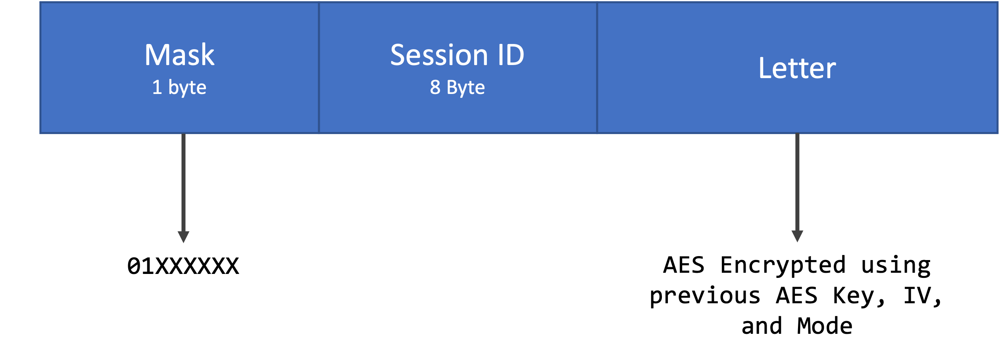

Session
=========

If the server can store sessions, it should hold the Microservice ID, AES Key, AES IV, and AES Mode for upcoming communications. The server should generate a unique random 64-bit (8-byte) session ID and should send a response to the client as the following image shows:

.. image:: session_response.png
   :width: 800
   :alt: Mask Representation
   
The time of death should be an 8-byte timestamp that tells the client when the session expires so that it knows when it is necessary to ask for a new one. If the server cannot generate a valid session, it should return the `session ID with 0 in all 8-byte`.

The session ID and Time of Death must be encrypted with the AES Key, IV, and Mode sent by the client and should be sent before the microservice's response. The microservice's response, if exists, should be encrypted with the AES context previously started.  

 

.. warning::
   Do not restart the AES context when you send the Microservice's response.
   

Client's Message with Session
---------------------------------

For the next interactions between the client and server, the client should send the following:

   
As one can see, the mask has its first bit at 0 to tell the server that the upcoming message is "unsecured". The second bit is 1, which tells the server to fetch a previously stored session. The following 8 bytes are the session ID sent by the server. These 8 bytes are unencrypted so that the server can read them. The letter follows the 8 bytes and is encrypted using the AES Key, IV, and Mode. 

The server and client should start a new AES context to encrypt ad decrypt the new message at each new connection, avoiding errors. 

Sessions reduce the protocol's overhead to 9 bytes and should be used whenever possible. 

.. note::
   Next protocol versions will provide a solution to use the same session for multiple microservices.
   
