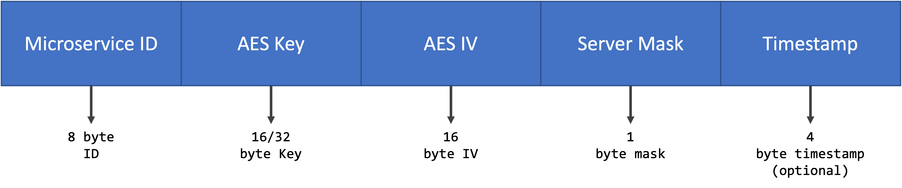
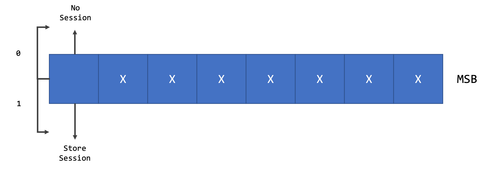

Stamp
======

.. note::

  The Stamp's size depends on the RSA key size chosen. For a 1024-bit, the minimum acceptable, the Stamp's size is 128 bytes. The size doubles as the key doubles in size.

.. note::

  The stamp must be msgpack serialized.
  

Server Mask 
-----------

The server mask was designed to give the protocol a few optimization possibilities and scalability. The leading optimization it provides is to ask the server to store a session. Currently, this is the only implementation for the server mask. Nevertheless, other applications are being developed. 

